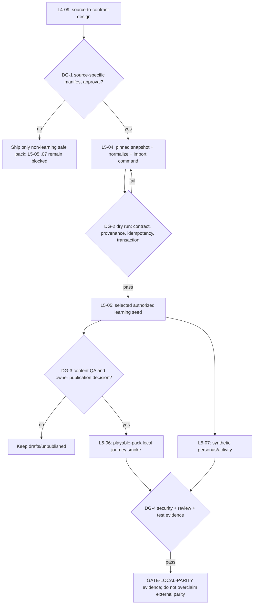

# Demo-data Implementation Plan v1

**Status:** implementation-ready architecture plan; not a rights approval.  
**Scope:** L4-09 and L5-04 through L5-07 only.  
**Safety rule:** an artifact is blocked unless the tracked `docs/LOCAL_DATA_PROVENANCE_MANIFEST.json` explicitly approves that exact artifact/source for the proposed use. A repository MIT license, public availability, an existing seed script, a fixture, or the general owner statement in the independent plan is not a substitute for source-specific approval.

## Current legally safe pack

The only pack that may be assembled now is **non-learning local demo infrastructure**:

1. `backend-service/scripts/bootstrap_local.py` (schema only);
2. `backend-service/app/core/shop_catalog.py` via `backend-service/scripts/seed_shop_items.py` (the explicitly listed minimal catalog); and
3. synthetic personas via `backend-service/scripts/seed_demo_data.py` and `backend-service/scripts/seed_analytics.py` (isolated synthetic namespaces only).

This is adequate for bootstrap, catalog, dashboard, gamification, and synthetic-activity demonstrations. It is **not a playable learning pack**: it contains no approved course, lesson, vocabulary, story, image, audio, exercise, RSS, Anki, IELTS, or KG learning artifact. In particular, `sample_data_catalog.py`, `categorized_words_final.json`, `sample_stories.json`, all KG data, `seed_questions.py`, `seed_vocab_from_anki.py`, the IELTS seed, and external crawlers remain blocked/held; no route, seed, or test may silently make them eligible.

To unlock one playable learning pack, the owner must supply a selected source-specific approval record and authorize adding it to the tracked manifest: exact source/artifact identity and version, rights holder and written reuse/distribution scope (demo/local/public as applicable), license ID and URL, required attribution, permitted fields and transformations, immutable source URL/location, retrieval date, SHA-256 raw snapshot checksum, record count, whether text/translations/images/audio are each cleared, and an approved publication scope. The input must also identify a minimum course payload (course/unit/lesson, at least one vocabulary item and exercise per lesson), any owned media or a decision for no media, and a named owner for correction/withdrawal. Until that decision is recorded, use only synthetic *metadata/personas*, never synthetic copies or paraphrases of blocked source content.

## Dependency DAG and decision gates



| Gate | Decision owner / evidence | Pass condition | On no/fail |
|---|---|---|---|
| DG-0 (before code) | Backend/data lead | Scope, target database, and dirty-tree isolation confirmed; only dedicated files are assigned. | Stop; do not touch existing seeds or content. |
| DG-1 (rights) | Content owner/rights holder | Manifest change explicitly names the selected source/artifact and its allowed use; all required owner inputs above are complete. | L5-04 may retain only no-content scaffolding; L5-05--L5-07 remain blocked. |
| DG-2 (import safety) | Backend/data lead + test writer | Offline fixture/snapshot passes v2 validation; repeated apply returns the same stable result; forced failure commits no partial entities. | Fix importer/fixture; no database seed run. |
| DG-3 (playability/publication) | Content owner + product owner | Human review signs off correctness, attribution/display, exercise answers, and explicit draft-versus-published status. | Preserve draft records; do not publish. |
| DG-4 (release) | Test writer, security reviewer when triggered, code reviewer | Required commands pass and reviewers find no unresolved blocking issue. | Keep branch unmerged; use rollback plan. |

## Work packages

| ID | Exact scope and proposed files | Owner / model routing | Acceptance criteria |
|---|---|---|---|
| **L4-09** | Define the source-to-contract mapping and importer boundary. Add `docs/demo-data/approved-source-register-v1.md` only after DG-1; add `backend-service/scripts/import_approved_course_artifact.py` as a thin local CLI that loads a declared immutable artifact, creates/locks a `ContentAgentJob`, calls `validate_artifact`, then `ContentAgentApplyService.apply`; add a dedicated package directory such as `backend-service/data/approved/` only for manifest-approved immutable inputs. Do **not** repurpose `import_course_content.py`, `seed_courses_directly.py`, or external crawlers. | Backend/data lead; **gpt-5.6-terra** for architecture/transaction boundary. **Antigravity Flash** may inventory paths, hash approved inputs, and maintain docs/fixtures after approval. | CLI refuses absent/mismatched source-register entry, unknown source, missing hash, invalid schema, unpinned manifest, or live URL acquisition; it makes no network request; successful input becomes a draft via existing apply service and has a ContentAgentJob/provenance trail. |
| **L5-04** | Implement the selected approved pipeline after DG-1: one adapter/normalizer in `ai-service/api/services/content_etl/` only if the approved source requires it; a checked-in *metadata* declaration and a non-content test fixture; artifact generation to `course-artifact-v2`; backend importer plus tests in `backend-service/tests/`. Preserve `raw_checksum`/record checksum/lineage and map ETL `raw_sha256` to artifact `raw_checksum` deliberately. | **gpt-5.6-terra** for importer, transaction design, and integration tests; **gpt-5.6-luna** for focused unit tests/review fixes; Flash only mechanical inventory/fixtures/docs. | Every imported vocabulary record has manifest and pin parity; source URL/license/attribution/usage/lineage satisfy v2; generated content cannot masquerade as imported; all external assets are absent unless independently approved; validation failures are reported before writes. |
| **L5-05** | Build one selected authorized seed command on top of L5-04, not a second direct seeder. Proposed files: `backend-service/scripts/seed_approved_demo_pack.py`, `backend-service/tests/test_seed_approved_demo_pack.py`, and only an owner-approved data manifest/input path. The command must support `--dry-run`, explicit input path, and an explicit local-only target guard. | Backend/data lead, **gpt-5.6-terra**; test writer, **gpt-5.6-luna**. | A dry run has zero writes; apply is idempotent; re-run neither duplicates courses/units/lessons/memberships/provenance nor overwrites curated vocabulary; failure rolls back atomically; output reports IDs/counts/checksums but never secrets or raw rights documents. |
| **L5-06** | Create the local playable-pack verification, not new content. Proposed files: `backend-service/tests/integration/test_approved_demo_pack_flow.py`, a minimal approved fixture under `contracts/content-agent/fixtures/` or `backend-service/tests/fixtures/`, and an optional documented local smoke command. Verify course discovery, draft/publication state, lesson vocabulary memberships, exercise rendering contract, and learner progression against the selected pack. | Test writer, **gpt-5.6-terra** for integration design; **gpt-5.6-luna** for regression coverage. | Starting from an empty local DB, the authorized fixture yields exactly the approved course/unit/lesson/vocabulary/exercise counts; each lesson has >=1 vocabulary and >=1 exercise; membership and provenance rows exist; a repeat run preserves counts; blocked artifacts remain absent. |
| **L5-07** | Add only synthetic persona/activity orchestration after the learning seed exists. Proposed files: `backend-service/scripts/seed_approved_demo_personas.py` or a narrow extension of the approved pack command, plus `backend-service/tests/test_seed_approved_demo_personas.py`. It may reference IDs created by L5-05 but must generate fictional accounts and state only; do not copy user data, names, progress, chats, or learning content. | Backend/data lead, **gpt-5.6-luna**; Flash for deterministic fixture inventory; terra reviews cleanup/transaction behavior. | Fixed seed produces deterministic counts; cleanup is restricted to a reserved synthetic namespace; it cannot delete arbitrary users or selected course content; re-run has no duplicate activity; no real email/production identifier enters fixture or output. |

## Implementation constraints

`ContentAgentApplyService` is the sole course-artifact materialization boundary: it locks the job, validates against pinned snapshots/admin attestation, applies inside its existing transaction, creates course/vocabulary provenance, links lesson vocabulary, and keeps courses unpublished. The proposed CLI must call this service rather than duplicate writes; `scripts/import_course_content.py` remains an administrative relational migration utility and is unsuitable because it bypasses v2 validation, vocabulary memberships, and provenance.

The v2 contract requires a course artifact with source manifest coverage; validation rejects unpinned/unknown sources, malformed hashes/URLs/lineage, unsupported license modes, invalid exercise mappings, duplicate orders/IDs, and lessons with no vocabulary or exercises. Exercise provenance is currently JSON within lesson content rather than relational `ContentProvenance`; DG-3 must decide whether existing course-level/job linkage and source manifest are sufficient for the selected approved pack before any claim of per-exercise attribution completeness.

No migration is planned: the documented v2 models/migrations already support `ContentAgentJob`, `ContentProvenance`, `VocabularyItem`, and `LessonVocabularyItem`. If a future approved source needs fields outside the contract, stop at a new schema/migration decision with security review; do not place unvalidated rights metadata in generic JSON to bypass the schema.

## Dirty-tree, worktree, and merge strategy

1. Treat the current tree as user-owned and dirty. Before each work package, record `git status --short`, `git diff --check`, and `git diff -- <assigned paths>`; never reset, stash, format, or edit unrelated changes.
2. Use one isolated child worktree/branch per package after DG-0. Assign exclusive paths: importer/transaction work to L4-09/L5-04, seed command to L5-05, integration tests to L5-06, persona seeding/tests to L5-07. No concurrent agent edits to a shared file.
3. Merge serially into an integration worktree in DAG order: L4-09 -> L5-04 -> L5-05 -> parallel L5-06 and L5-07 only after their shared seed interface is frozen. Rebase/reconcile only the package-owned paths; preserve all pre-existing modifications.
4. Keep each package reviewable and reversible. Do not commit, merge, or mark a ledger item complete until its gate evidence and required reviews are recorded; update the independent plan only in the final reconciliation package.

## Verification commands and measurable evidence

Run from the indicated service directory with its established environment; commands below are test targets, not permission to connect to external services or seed a shared database.

```powershell
# Repository hygiene (before/after each package)
git status --short
git diff --check

# Contract and backend apply/validation boundary
Set-Location backend-service
pytest tests/test_content_agent_validation.py tests/test_content_agent_apply.py tests/test_content_contract_parity.py -q
pytest tests/integration/test_content_agent_licensed_etl_flow.py -q

# After the new seed/import work exists
pytest tests/test_seed_approved_demo_pack.py tests/test_seed_approved_demo_personas.py tests/integration/test_approved_demo_pack_flow.py -q

# AI-side contract/ETL parity only when L5-04 adds/changes an adapter
Set-Location ../ai-service
pytest tests/content_etl/test_contracts.py tests/content_etl/test_pipeline.py tests/test_content_contract_parity.py tests/integration/test_licensed_etl_content_agent_flow.py -q
```

Acceptance evidence must include: checked input checksum and record count; validation report with zero blocking errors; before/after entity counts for both first and second local run; explicit rollback test result; evidence that the course is draft until DG-3; reserved-namespace cleanup proof; and `git diff --check` with only package-owned paths. The minimal safe pack can be verified independently with its existing bootstrap/shop/synthetic seed tests, but must be described as non-playable.

## Security-review triggers and rollback

Security reviewer is mandatory if implementation adds or changes an API route, authentication/authorization, admin upload handling, file/archive extraction, object storage, environment/config, secrets, database migration, a new externally reachable URL fetch, or publication controls. For the intended local CLI plus existing service boundary, request security review anyway before DG-4 because it processes rights attestations and files; code reviewer is required before PR, and a test-writer owns new feature coverage under `AGENTS.md`.

Rollback is package-scoped: stop the CLI on validation failure; rely on the apply transaction for all-or-nothing writes; retain immutable input/checksum evidence; keep created courses unpublished until DG-3; and remove only rows identified by the new job ID or the reserved synthetic namespace through a reviewed rollback command. Never use broad table truncation, arbitrary email deletion, or deletion based on source text. If the owner withdraws approval or checksum/rights metadata changes, disable the seed entrypoint, keep the artifact blocked, unpublish its job-linked courses, and execute the reviewed job-scoped cleanup before a new approval is considered.

## Explicit non-goals

This plan neither approves content nor performs acquisition, crawling, database writes, network access, migrations, config changes, commits, or deployment. It does not unblock external RSS, Anki, IELTS, stories, KG, sample courses, wordlists, media URLs, or test fixtures; each remains unavailable unless a future manifest amendment explicitly approves the exact source and use.
