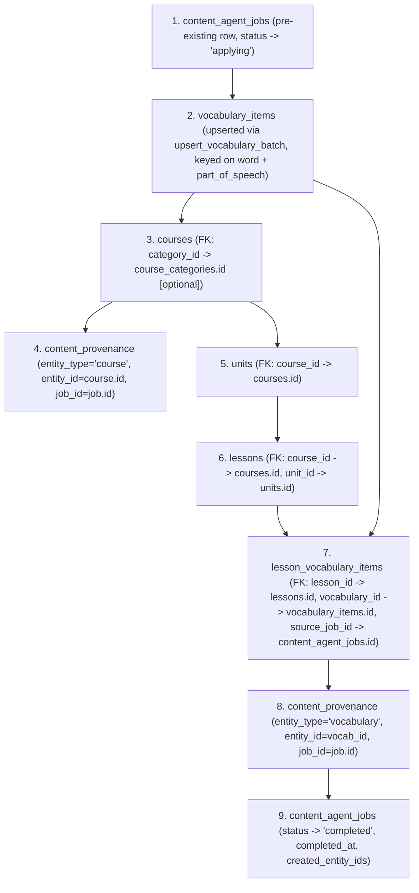
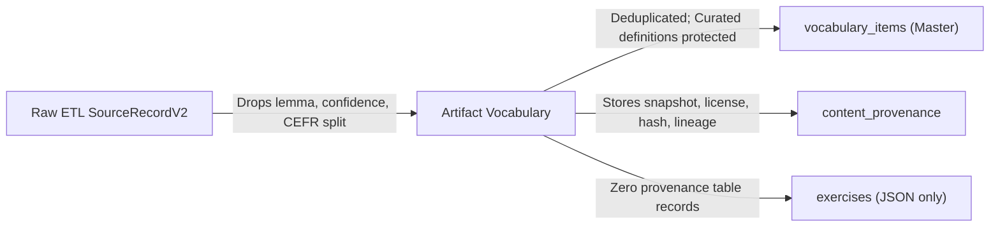

# LexiLingo Contract & Schema Mapping Specification (v1)

**Document Reference:** `docs/demo-data/schema-mapping-v1.md`  
**Execution Context:** WAVE A2 — Contract and Schema Mapping Analysis  
**Target Repository:** `C:\Users\hoang\orca\workspaces\lexilingo-clean-v1\run-local`  
**Date:** 2026-09-10  
**Status:** Canonical Reference (Document-Only Analysis / No Production Code Changes)

---

## 1. Executive Summary & Quality Gates

This specification documents the end-to-end data contract, relational schema, and provenance topology across the LexiLingo content ecosystem. It traces data from external normalized source datasets (ETL) through AI content-agent course generation artifacts, pure boundary validation, and transactional database application, down to low-level database export/import scripts.

### 1.1 Quality Gates Compliance
1. **Exact Path Naming:** Every mapped schema, Pydantic model, SQLAlchemy ORM entity, Alembic migration, and service method is identified by its repository path.
2. **Fact vs. Recommendation:** Concrete codebase implementations ("Observed Fact") are strictly separated from architectural suggestions ("Recommendation").
3. **Mismatches & Unknowns:** Structural differences between ETL contracts, artifact schemas, and database tables are cataloged with field-level precision.
4. **No Code Mutations:** Repository analysis is read-only; no application code, database rows, or environment configurations are altered.
5. **No Migration Policy:** Repository inspection confirms the database schema already supports all contract v2 entities. No migration is proposed.

---

## 2. Inspected Artifacts & Authoritative Source Paths

| Component | Repository Path | Responsibility / Artifact Type |
|---|---|---|
| **Source Record Contract** | `contracts/content-agent/source-record-v2.schema.json` | JSON Schema draft 2020-12 defining normalized licensed source records. |
| **Course Artifact Contract** | `contracts/content-agent/course-artifact-v2.schema.json` | JSON Schema draft 2020-12 defining full course generation artifacts. |
| **Exercise Types Contract** | `contracts/content-agent/exercise-types-v1.json` | UI type to engine base type taxonomy mapping. |
| **Contract Fixture** | `contracts/content-agent/fixtures/licensed-etl-artifact-v2.json` | Reference test fixture demonstrating valid v2 course and provenance. |
| **AI Content ETL Contracts** | `ai-service/api/services/content_etl/contracts.py` | Pydantic v2 models: `SourceRecordV2`, `SourceManifest`, `SourceLineage`, `AudioReference`. |
| **AI Content Agent Models** | `ai-service/api/models/content_agent.py` | Pydantic v2 generation models: `NormalizedSourceRecord`, `CourseArtifact`, `ExerciseArtifact`, `VocabularyArtifact`. |
| **Backend Content Agent Schemas** | `backend-service/app/schemas/content_agent.py` | Pydantic v2 validation models: `ContentAgentArtifact`, `ArtifactSourceManifest`, `NormalizedVocabularyRecord`. |
| **Backend Course Schemas** | `backend-service/app/schemas/course.py` | Course, Unit, Lesson, and playable Exercise API response schemas. |
| **Backend Vocabulary Schemas** | `backend-service/app/schemas/vocabulary.py` | VocabularyItem request/response models and SRS models. |
| **Backend Course ORM Models** | `backend-service/app/models/course.py` | SQLAlchemy ORM models: `Course`, `Unit`, `Lesson`, `MediaResource`. |
| **Backend Vocabulary ORM Models** | `backend-service/app/models/vocabulary.py` | SQLAlchemy ORM models: `VocabularyItem`, `UserVocabulary`, `VocabularyReview`. |
| **Backend Content Agent ORM** | `backend-service/app/models/content_agent.py` | SQLAlchemy ORM models: `ContentAgentJob`, `ContentAgentUpload`, `LessonVocabularyItem`, `ContentProvenance`. |
| **Artifact Traversal Indexer** | `backend-service/app/services/content_agent_artifact_index.py` | `build_artifact_index` and typed structural AST nodes. |
| **Artifact Validation Service** | `backend-service/app/services/content_agent_validation.py` | Pure, database-free validation gates (`validate_artifact`). |
| **Content Agent Apply Service** | `backend-service/app/services/content_agent_apply.py` | Transactional database materializer (`ContentAgentApplyService.apply`). |
| **Vocabulary Batch Upserter** | `backend-service/app/services/vocabulary_catalog.py` | Concurrency-safe vocabulary upsert with `SELECT ... FOR UPDATE` locks (`upsert_vocabulary_batch`). |
| **Course Content Exporter** | `backend-service/scripts/export_course_content.py` | Flat JSON table exporter for published course content. |
| **Course Content Importer** | `backend-service/scripts/import_course_content.py` | Flat JSON table importer with category remapping and dry-run rollback. |
| **Local Provenance Manifest** | `docs/LOCAL_DATA_PROVENANCE_MANIFEST.json` | Local licensing catalog and seed policy. |

---

## 3. End-to-End Pipeline & Relational Foreign Key Topology

### 3.1 Pipeline Stages
```
[External Licensed Datasets] (OEWN, CMUDict, CEFR-J, Wikidata, Tatoeba, LibriSpeech, Common Voice, OER Curriculum, Admin Upload)
                         │
                         ▼
        [ai-service/api/services/content_etl]
          • Normalizes raw files into `SourceRecordV2`
          • Calculates canonical sha256 checksums
          • Produces ETL snapshot + `SourceManifest`
                         │
                         ▼
        [ai-service/api/services/content_agent]
          • Pins snapshots to `ContentAgentJob`
          • Generates `ContentAgentArtifact` (schema_version: 2)
                         │
                         ▼
        [backend-service: validate_artifact]
          • Pure artifact validation (zero DB I/O)
          • Enforces checksums, URLs, CEFR/POS enums, exercise mappings, license modes
                         │
                         ▼
        [backend-service: ContentAgentApplyService]
          • Atomically applies valid artifact inside an AsyncSession transaction
          • Deduplicates & upserts vocabulary via `upsert_vocabulary_batch`
          • Inserts Course, Unit, Lesson relational hierarchy
          • Populates `lesson_vocabulary_items` and `content_provenance`
```

### 3.2 Relational Transaction Insertion Ordering & FK Chain

To satisfy relational constraints without foreign key violations, `ContentAgentApplyService.apply` writes in the following strict topological order:



1. **`content_agent_jobs`**: Must exist in `preview_ready` status. Status transitioned to `applying`.
2. **`vocabulary_items`**: Batched and upserted before course tree insertion. Obtains stable `UUID` map `(normalized_word, part_of_speech) -> vocabulary_item.id`.
3. **`courses`**: Inserted with `is_published = False`. Generates `course.id`.
4. **`content_provenance` (Course Level)**: Inserted referencing `job.id` and `course.id`.
5. **`units`**: Inserted referencing `course.id` (`ondelete="CASCADE"`). Generates `unit.id`.
6. **`lessons`**: Inserted referencing `course.id` and `unit.id` (`ondelete="CASCADE"`). Exercises stored directly inside `lessons.content` JSONB.
7. **`lesson_vocabulary_items`**: Junction records inserted referencing `lesson.id`, `vocabulary_id`, and `source_job_id`.
8. **`content_provenance` (Vocabulary Level)**: Inserted referencing `job.id` and `vocabulary_id` for every vocabulary entry used in each lesson.
9. **`content_agent_jobs` (Completion)**: Status updated to `completed`, recording `created_entity_ids = {"course_ids": [...]}`.

---

## 4. Detailed Field-by-Field Mapping Specification

### 4.1 Source Record Mapping (`SourceRecordV2`)
* **Authoritative Contract:** `contracts/content-agent/source-record-v2.schema.json`
* **ETL Implementation:** `ai-service/api/services/content_etl/contracts.py:SourceRecordV2`
* **Content Agent Implementation:** `ai-service/api/models/content_agent.py:NormalizedSourceRecord`
* **Backend Validation Model:** `backend-service/app/schemas/content_agent.py:NormalizedVocabularyRecord`

| Source Field (`SourceRecordV2`) | Type & Constraints | Required | Target Field in Artifact Vocabulary | Validation Owner | Description / Rules |
|---|---|---|---|---|---|
| `schema_version` | integer, const `2` | Yes | Artifact root: `schema_version` | `SourceRecordV2`, `validate_artifact` | Identifies v2 contract format. |
| `record_id` | string (1-500) | Yes | Dropped / internal ID | `SourceRecordV2` | Unique identifier within normalized dataset snapshot. |
| `source_name` | enum: `oewn`, `cmudict`, `cefr_j`, `wikidata`, `tatoeba`, `librispeech`, `common_voice`, `oer_curriculum`, `admin_upload` | Yes | `vocabulary.source_name` | `SourceRecordV2`, `_check_provenance` | Must match approved sources registry. `oer_curriculum` is strictly offline-only and blocked until immutable snapshot. |
| `source_version` | string (1-64) | Yes | `vocabulary.source_version` | `SourceRecordV2`, `_check_provenance` | Upstream snapshot version (e.g., `"2025"`). |
| `source_record_id` | string (1-500) | Yes | `vocabulary.source_record_id` | `SourceRecordV2`, `_check_provenance` | Upstream unique record key (e.g., `"oewn-entry-0"`). |
| `source_url` | string URI (max 1000, HTTPS) | Yes | `vocabulary.source_url` | `SourceRecordV2`, `_check_urls` | Official source item URL; host validated against allowlist. |
| `license_id` | enum: `CC0-1.0`, `CC-BY-2.0-FR`, `CC-BY-4.0`, `LicenseRef-CMUdict`, `LicenseRef-CEFR-J-Commercial`, `LicenseRef-Admin-Owned`, `LicenseRef-Generated` | Yes | `vocabulary.license_id` | `SourceRecordV2`, `_check_provenance` | Approved license identifier. Must match source allowlist. |
| `license_url` | string URI (max 1000, HTTPS) | Yes | `vocabulary.license_url` | `SourceRecordV2`, `_check_manifest_coverage` | Legal deed / license terms URL. |
| `attribution_text` | string (1-2000) | Yes | `vocabulary.attribution_text` | `SourceRecordV2`, `_check_provenance` | Mandatory attribution notice for third-party compliance. |
| `content_usage` | enum: `lexical`, `pronunciation`, `label`, `topic`, `example`, `audio` | Yes | `vocabulary.content_usage` | `SourceRecordV2`, `_check_provenance` | Usage scope. Determines required payload fields. |
| `language` | string regex `^[a-z]{2,3}(-[A-Z]{2})?$` | Yes | Inherited by course (`course.language`) | `SourceRecordV2` | BCP-47 language tag (e.g., `"en"`). |
| `word` | string (max 255) | Optional (conditional) | `vocabulary.word` | `clean_word`, `normalize_word` | Target lexical headword. Whitespace cleaned. |
| `lemma` | string (max 255) | Optional | **Lost in Artifact** | `SourceRecordV2` | Base/dictionary form. Not forwarded to `VocabularyArtifact`. |
| `part_of_speech` | enum: `noun`, `verb`, `adjective`, `adverb`, `pronoun`, `preposition`, `conjunction`, `interjection`, `phrase` | Optional | `vocabulary.part_of_speech` | `_check_pos_enum` | Grammatical category. |
| `definition` | string (max 10000) | Optional (Req for `lexical`) | `vocabulary.definition` | `_check_definition_length` | English definition. Validated 10-2000 chars in artifact. |
| `translation_vi` | string (max 5000) | Optional | `vocabulary.translation_vi` | `_check_translation_shape` | Vietnamese equivalent if available. |
| `example` | string (max 10000) | Optional (Req for `example`) | `vocabulary.example` | `SourceRecordV2` | Exemplary sentence demonstrating usage. |
| `pronunciation` | string (max 500) | Optional (Req for `pronunciation`) | `vocabulary.pronunciation` | `SourceRecordV2` | IPA representation (e.g., `"/həˈloʊ/"`). |
| `audio` | object: `{url, mime_type, duration_seconds, speaker_attribution}` | Optional (Req for `audio`) | Flattened to `vocabulary.audio_url` | `SourceRecordV2`, `_check_urls` | Audio reference. Sub-fields (speaker, duration) dropped. |
| `declared_cefr` | enum: `A1`, `A2`, `B1`, `B2`, `C1`, `C2` | Optional (Req for `label`) | `vocabulary.difficulty_level` | `_check_cefr_enum` | Upstream official CEFR classification. |
| `assigned_cefr` | enum: `A1`, `A2`, `B1`, `B2`, `C1`, `C2` | Optional | **Lost in Artifact** | `SourceRecordV2` | ML/heuristic assigned CEFR level. Not preserved. |
| `classification_confidence`| float [0.0, 1.0] | Optional | **Lost in Artifact** | `SourceRecordV2` | CEFR classifier confidence score. Not preserved. |
| `topic_ids` | array of strings (max 100, unique) | Optional (Req for `topic`) | Collapsed to `vocabulary.topic` (scalar) | `SourceRecordV2` | Semantic taxonomy tags. Flattened to single topic string. |
| `retrieved_at` | string date-time (timezone aware) | Yes | Forwarded only in `source_manifest` | `SourceRecordV2` | Extraction timestamp. Per-record timestamp dropped in vocab. |
| `raw_checksum` | string sha256 `^[a-f0-9]{64}$` | Yes | `vocabulary.raw_checksum` | `_check_provenance` | SHA-256 digest of original raw snapshot archive. |
| `record_checksum` | string sha256 `^[a-f0-9]{64}$` | Yes | `vocabulary.record_checksum` | `compute_source_record_checksum` | Canonical JSON SHA-256 digest of record contents. |
| `lineage` | object: `{adapter, adapter_version, raw_path, source_location}` | Yes | `vocabulary.lineage` | `_check_provenance` | Transformation lineage tracking adapter and offset. |
| `metadata` | object | Optional | Dropped / merged into job config | `SourceRecordV2` | Arbitrary adapter-specific metadata. |

---

### 4.2 Source Manifest Mapping (`SourceManifest` / `ArtifactSourceManifest`)
* **Contract Reference:** `contracts/content-agent/course-artifact-v2.schema.json:#/$defs/sourceManifest`
* **ETL Model:** `ai-service/api/services/content_etl/contracts.py:SourceManifest`
* **Backend Schema:** `backend-service/app/schemas/content_agent.py:ArtifactSourceManifest`
* **Stored Entity:** `backend-service/app/models/content_agent.py:ContentAgentJob.source_manifest` (JSONB)

| Manifest Field | Type & Format | Required | Target DB Field / Location | Validation Owner | Notes & Differences |
|---|---|---|---|---|---|
| `snapshot_id` | string (1-500) | Yes | `content_agent_jobs.source_manifest[*].snapshot_id` | `_check_manifest_coverage` | Deterministic key: `{source_name}:{source_version}:{raw_checksum}`. |
| `source_name` | enum (`ArtifactSourceName`) | Yes | `content_agent_jobs.source_manifest[*].source_name` | `_check_manifest_coverage` | Must match contract/job source (`oewn`, `cmudict`, `cefr_j`, `wikidata`, `tatoeba`, `librispeech`, `common_voice`, `oer_curriculum`, `admin_upload`). `oer_curriculum` is offline-only and blocked until immutable snapshot. |
| `source_version` | string (1-64) | Yes | `content_agent_jobs.source_manifest[*].source_version` | `_check_manifest_coverage` | Upstream snapshot version string. |
| `official_url` | string URI (max 1000) | Yes | `content_agent_jobs.source_manifest[*].official_url` | `_check_manifest_coverage` | Upstream official portal URL. |
| `license_id` | string (1-128) | Yes | `content_agent_jobs.source_manifest[*].license_id` | `_check_manifest_coverage` | Approved license identifier. |
| `license_url` | string URI (max 1000) | Yes | `content_agent_jobs.source_manifest[*].license_url` | `_check_manifest_coverage` | License deed URL. |
| `attribution_text` | string (1-2000) | Yes | `content_agent_jobs.source_manifest[*].attribution_text` | `_check_manifest_coverage` | Attribution text for the entire snapshot. |
| `retrieved_at` | date-time ISO-8601 | Yes | `content_agent_jobs.source_manifest[*].retrieved_at` | `_check_manifest_coverage` | Snapshot acquisition timestamp. |
| `raw_checksum` | string sha256 (64 hex) | Yes | `content_agent_jobs.source_manifest[*].raw_checksum` | `_check_manifest_coverage` | **Explicit Mapping:** Direct mapping from ETL `SourceManifest.raw_sha256` → artifact `raw_checksum` at the import/generation translation boundary. |
| `normalized_sha256` | string sha256 (64 hex) | Yes | `content_agent_jobs.source_manifest[*].normalized_sha256` | `_check_manifest_coverage` | SHA-256 of canonical normalized JSON lines. |
| `normalized_bytes` | integer (positive) | Yes | `content_agent_jobs.source_manifest[*].normalized_bytes` | `_check_manifest_coverage` | Byte size of normalized dataset file. |
| `record_checksum_root` | string sha256 (64 hex) | Yes | `content_agent_jobs.source_manifest[*].record_checksum_root` | `_check_manifest_coverage` | Merkle root / combined digest of sorted record checksums. |
| `adapter_version` | integer (positive) | Yes | `content_agent_jobs.source_manifest[*].adapter_version` | `_check_manifest_coverage` | Integer version of normalization adapter. |
| `record_count` | integer (positive) | Yes | `content_agent_jobs.source_manifest[*].record_count` | `_check_manifest_coverage` | **Explicit Mapping:** Flat integer in artifact schema mapped directly from ETL `SourceManifest.counts.approved` (or `counts.normalized`) → artifact `record_count`. |

---

### 4.3 Course Mapping (`CourseArtifact` -> `Course`)
* **Contract Reference:** `contracts/content-agent/course-artifact-v2.schema.json:#/$defs/course`
* **Artifact Model:** `backend-service/app/schemas/content_agent.py:CourseArtifact`
* **ORM Entity:** `backend-service/app/models/course.py:Course` (Table: `courses`)
* **Service Handler:** `backend-service/app/services/content_agent_apply.py:ContentAgentApplyService.apply`

| Artifact Field | Type & Constraints | Target ORM Column (`courses`) | Column Type & Constraints | Value / Transformation Logic | Validation Owner |
|---|---|---|---|---|---|
| *(auto-generated)* | N/A | `id` | GUID, PK | `uuid.uuid4()` | ORM default / Apply service |
| `title` | string (1-255) | `title` | String(255), not null | `course_data.title` | `CourseArtifact`, `CourseBase` |
| `description` | string | `description` | Text, nullable | `course_data.description` | `CourseArtifact` |
| `language` | const `"en"` | `language` | String(10), not null | `course_data.language` (`"en"`) | `CourseArtifact` |
| `level` | enum: `A1`..`C2` | `level` | String(20), not null, index | `course_data.level` | `_check_course_levels` |
| *(category link)* | N/A | `category_id` | GUID, FK `course_categories.id`, nullable | Defaults to `None` in Content Agent Apply | Backend CRUD |
| *(skill credit)* | N/A | `skill` | String(20), nullable | Defaults to `None` on Course (falls back to lesson skill) | `CourseBase` |
| `tags` | list[string] | `tags` | PortableJSON (dict) | Transformed by `_course_tags`: `{"categories": ["cefr", level], "source": ["content-agent"], "topics": [...]}` | `ContentAgentApplyService` |
| *(computed)* | N/A | `total_lessons` | Integer, default 0 | `sum(len(u.lessons) for u in course_data.units)` | `ContentAgentApplyService` |
| *(computed)* | N/A | `total_xp` | Integer, default 0 | `sum(l.xp_reward for u in course_data.units for l in u.lessons)` | `ContentAgentApplyService` |
| *(computed)* | N/A | `estimated_duration`| Integer, default 0 | `sum(l.estimated_minutes for u in course_data.units for l in u.lessons)` | `ContentAgentApplyService` |
| *(publication)* | N/A | `is_published` | Boolean, default False, index | **Strictly `False`** upon apply. Requires explicit manual review. | `ContentAgentApplyService` |
| *(versioning)* | N/A | `content_version` | Integer, default 1 | `1` | ORM default |
| *(asset)* | N/A | `thumbnail_url` | String(500), nullable | Defaults to `None` | ORM default |
| *(timestamp)* | N/A | `created_at` | TZDateTime | `datetime.now(timezone.utc)` | ORM default |
| *(timestamp)* | N/A | `updated_at` | TZDateTime | `datetime.now(timezone.utc)` | ORM default |

---

### 4.4 Unit Mapping (`UnitArtifact` -> `Unit`)
* **Contract Reference:** `contracts/content-agent/course-artifact-v2.schema.json:#/$defs/unit`
* **Artifact Model:** `backend-service/app/schemas/content_agent.py:UnitArtifact`
* **ORM Entity:** `backend-service/app/models/course.py:Unit` (Table: `units`)
* **Service Handler:** `backend-service/app/services/content_agent_apply.py:ContentAgentApplyService.apply`

| Artifact Field | Type & Constraints | Target ORM Column (`units`) | Column Type & Constraints | Value / Transformation Logic | Validation Owner |
|---|---|---|---|---|---|
| *(auto-generated)* | N/A | `id` | GUID, PK | `uuid.uuid4()` | ORM default / Apply service |
| *(parent FK)* | N/A | `course_id` | GUID, FK `courses.id` (`CASCADE`), not null, index | Populated from parent `course.id` | `ContentAgentApplyService` |
| `title` | string (1-255) | `title` | String(255), not null | `unit_data.title` | `UnitArtifact`, `UnitBase` |
| `description` | string | `description` | Text, nullable | `unit_data.description` | `UnitArtifact` |
| `order_index` | integer (ge 0) | `order_index` | Integer, not null | `unit_data.order_index` | `UnitArtifact` |
| *(styling)* | N/A | `background_color` | String(20), nullable | Defaults to `None` | ORM default |
| *(styling)* | N/A | `icon_url` | String(500), nullable | Defaults to `None` | ORM default |
| *(computed)* | N/A | `total_lessons` | Integer, default 0 | `len(unit_data.lessons)` | `ContentAgentApplyService` |
| *(timestamp)* | N/A | `created_at` | TZDateTime | `datetime.now(timezone.utc)` | ORM default |
| *(timestamp)* | N/A | `updated_at` | TZDateTime | `datetime.now(timezone.utc)` | ORM default |

---

### 4.5 Lesson Mapping (`LessonArtifact` -> `Lesson`)
* **Contract Reference:** `contracts/content-agent/course-artifact-v2.schema.json:#/$defs/lesson`
* **Artifact Model:** `backend-service/app/schemas/content_agent.py:LessonArtifact`
* **ORM Entity:** `backend-service/app/models/course.py:Lesson` (Table: `lessons`)
* **Service Handler:** `backend-service/app/services/content_agent_apply.py:ContentAgentApplyService.apply`

| Artifact Field | Type & Constraints | Target ORM Column (`lessons`) | Column Type & Constraints | Value / Transformation Logic | Validation Owner |
|---|---|---|---|---|---|
| *(auto-generated)* | N/A | `id` | GUID, PK | `uuid.uuid4()` | ORM default / Apply service |
| *(parent FK)* | N/A | `course_id` | GUID, FK `courses.id` (`CASCADE`), not null, index | Populated from parent `course.id` | `ContentAgentApplyService` |
| *(parent FK)* | N/A | `unit_id` | GUID, FK `units.id` (`CASCADE`), nullable, index | Populated from parent `unit.id` | `ContentAgentApplyService` |
| `title` | string (1-255) | `title` | String(255), not null | `lesson_data.title` | `LessonArtifact`, `LessonBase` |
| `description` | string | `description` | Text, nullable | `lesson_data.description` | `LessonArtifact` |
| `outcome` | string | `outcome` | Text, nullable | Can-do / TBLT mission statement | `LessonArtifact`, `LessonBase` |
| `order_index` | integer (ge 0) | `order_index` | Integer, not null | `lesson_data.order_index` | `_check_unique_lesson_orders` |
| *(lesson type)* | N/A | `lesson_type` | String(50), default `"lesson"` | Hardcoded to `"vocabulary"` in apply service | `ContentAgentApplyService` |
| *(skill credit)* | N/A | `skill` | String(20), nullable | Derived via `_lesson_skill(exercises)`: `"listening"` if any exercise has audio, else `"vocabulary"` | `ContentAgentApplyService` |
| *(pass rule)* | N/A | `pass_threshold` | Integer, default 80 | Defaults to `80` (%) | `ContentAgentApplyService` |
| `estimated_minutes`| integer (1-120) | `estimated_minutes` | Integer, default 10 | `lesson_data.estimated_minutes` | `LessonArtifact` |
| `xp_reward` | integer (ge 0) | `xp_reward` | Integer, default 10 | `lesson_data.xp_reward` | `LessonArtifact` |
| *(prerequisites)* | N/A | `prerequisites` | GUIDArray, default `[]` | Defaults to `[]` | ORM default |
| `exercises` | list[Exercise] | `content` | PortableJSON (dict) | `{"version": 2, "generated_by": "cefr-content-agent", "source_job_id": str(job.id), "exercises": [...]}` | `ContentAgentApplyService` |
| *(computed)* | N/A | `total_exercises` | Integer, default 0 | `len(exercises)`, kept in sync via `@validates("content")` | `_sync_total_exercises` |
| *(versioning)* | N/A | `content_version` | Integer, default 1 | `1` | ORM default |
| *(timestamp)* | N/A | `created_at` | TZDateTime | `datetime.now(timezone.utc)` | ORM default |
| *(timestamp)* | N/A | `updated_at` | TZDateTime | `datetime.now(timezone.utc)` | ORM default |

---

### 4.6 Exercise Mapping (`ExerciseArtifact` -> `Lesson.content["exercises"]`)
* **Contract Reference:** `contracts/content-agent/course-artifact-v2.schema.json:#/$defs/exercise`
* **Taxonomy Reference:** `contracts/content-agent/exercise-types-v1.json`
* **Python Enum Mirror:** `backend-service/app/models/course.py:UI_TYPE_TO_BASE_TYPE`
* **Database Destination:** Embedded JSON in `lessons.content["exercises"]` (No standalone `exercises` table exists).

| Exercise Field | Type & Constraints | Target Location in Lesson JSON | Validation Owner | Description & Operational Rules |
|---|---|---|---|---|
| `id` | string (1-100) | `exercises[*].id` | `_check_exercise_ids` | Globally unique ID across the entire artifact. |
| `type` | enum: `multiple_choice`, `true_false`, `fill_blank`, `translate`, `matching`, `reorder` | `exercises[*].type` | `_check_exercise_type_ui_type` | Runtime engine base interaction type. |
| `ui_type` | string (1-100) | `exercises[*].ui_type` | `_check_exercise_type_ui_type` | Presentation UI widget type. Must resolve to `type` via `UI_TYPE_TO_BASE_TYPE`. |
| `phase` | enum: `pre_task`, `task_cycle`, `language_focus` | `exercises[*].phase` | `ExerciseArtifact` | Pedagogical TBLT phase (defaults to `task_cycle`). |
| `concept_id` | string (max 255) | `exercises[*].concept_id` | `ExerciseArtifact` | Mastery tracking slug (e.g., `"vocab:travel"`). |
| `question` | string (1-10000) | `exercises[*].question` | `_check_speaking_listening_text` | Prompt displayed to learner. Non-empty required if audio present. |
| `options` | array \| null | `exercises[*].options` | `_check_options` | Available choices. For `multiple_choice`, at least 2 options required. |
| `correct_answer` | string (1-10000) | `exercises[*].correct_answer`| `ExerciseArtifact` | Ground truth evaluation string. |
| `explanation` | string (max 10000) \| null | `exercises[*].explanation` | `ExerciseArtifact` | Pedagogical rationalization shown after submission. |
| `hint` | string (max 5000) \| null | `exercises[*].hint` | `ExerciseArtifact` | Optional hint for learner. |
| `audio_url` | string URI (max 1000) \| null | `exercises[*].audio_url` | `_check_urls` | Audio listening asset. Must be valid HTTP/HTTPS URL. |
| `image_url` | string URI (max 1000) \| null | `exercises[*].image_url` | `_check_urls` | Accompanying visual image URL. Valid HTTP/HTTPS required. |
| `difficulty` | integer (1-5) | `exercises[*].difficulty` | `ExerciseArtifact` | Relative difficulty score. |
| `points` | integer (ge 0) | `exercises[*].points` | `ExerciseArtifact` | Gamification XP granted on completion (defaults to 10). |

---

### 4.7 Vocabulary Mapping (`VocabularyArtifact` -> `VocabularyItem` + `LessonVocabularyItem`)
* **Contract Reference:** `contracts/content-agent/course-artifact-v2.schema.json:#/$defs/vocabulary`
* **Artifact Model:** `backend-service/app/schemas/content_agent.py:VocabularyArtifact`
* **ORM Entity 1:** `backend-service/app/models/vocabulary.py:VocabularyItem` (Master catalog table: `vocabulary_items`)
* **ORM Entity 2:** `backend-service/app/models/content_agent.py:LessonVocabularyItem` (Junction table: `lesson_vocabulary_items`)
* **Service Handler:** `backend-service/app/services/vocabulary_catalog.py:upsert_vocabulary_batch`

| Artifact Vocabulary Field | Destination Table | Destination Column | DB Type & Constraints | Transformation / Upsert Behavior |
|---|---|---|---|---|
| `word` | `vocabulary_items` | `word` | String(255), not null, index | Canonicalized via `normalize_word`: NFKC unicode normalization, lowercased, punctuation-stripped, whitespace collapsed. Part of Unique Key `(word, part_of_speech)`. |
| `part_of_speech` | `vocabulary_items` | `part_of_speech` | Enum(`PartOfSpeech`), not null, index | Part of Unique Key `(word, part_of_speech)`. |
| `definition` | `vocabulary_items` | `definition` | Text, not null | **Curated Protection Rule:** Updated only if existing definition in DB is blank or empty! Never overwrites curated human content. |
| `translation_vi` + `example` | `vocabulary_items` | `translation` | PortableJSON (dict), nullable | Formatted via `_translation_payload`: `{"vi": translation_vi, "examples": [example]}`. Written only if existing translation is null. |
| `pronunciation` | `vocabulary_items` | `pronunciation` | String(100), nullable | Written only if existing pronunciation is empty/null. |
| `audio_url` | `vocabulary_items` | `audio_url` | String(500), nullable | Written only if existing audio_url is empty/null. |
| `difficulty_level` | `vocabulary_items` | `difficulty_level` | Enum(`DifficultyLevel`), not null, index | Set on row insert. |
| `topic` + `source_name` | `vocabulary_items` | `tags` | PortableJSON (dict) | Set on row insert: `{"source": ["content-agent", source_name], "topic": [topic]}`. |
| *(relationship link)* | `vocabulary_items` | `course_id`, `lesson_id`| GUID, nullable | Set to `NULL` (Many-to-many relationship is normalized in `lesson_vocabulary_items`). |
| *(parent lesson FK)* | `lesson_vocabulary_items` | `lesson_id` | GUID, FK `lessons.id` (`CASCADE`), not null | Links lesson to vocabulary word. |
| *(vocabulary FK)* | `lesson_vocabulary_items` | `vocabulary_id` | GUID, FK `vocabulary_items.id` (`CASCADE`), not null | Resolved stable UUID from `upsert_vocabulary_batch`. |
| *(provenance link)* | `lesson_vocabulary_items` | `source_job_id` | GUID, FK `content_agent_jobs.id`, nullable | Links to generation job that introduced this pairing. |
| *(ordering)* | `lesson_vocabulary_items` | `order_index` | Integer, not null | Order of vocabulary word within lesson (0-indexed). |
| *(status)* | `lesson_vocabulary_items` | `is_primary` | Boolean, default True | Marks core target vocabulary for this lesson. |

---

### 4.8 Stored DB Provenance Mapping (`ContentProvenance`)
* **ORM Entity:** `backend-service/app/models/content_agent.py:ContentProvenance` (Table: `content_provenance`)
* **Migration Reference:** `backend-service/alembic/versions/add_content_provenance_v2.py`
* **Service Handler:** `backend-service/app/services/content_agent_apply.py:ContentAgentApplyService.apply`

`content_provenance` records granular audit trails for both Course entities and Vocabulary entities.

| Column Name | DB Column Type & Constraints | Course Provenance Value | Vocabulary Provenance Value |
|---|---|---|---|
| `id` | GUID, PK, default `uuid.uuid4` | Generated UUID | Generated UUID |
| `job_id` | GUID, FK `content_agent_jobs.id` (`CASCADE`), not null | `job.id` | `job.id` |
| `entity_type` | String(50), not null, index | `"course"` | `"vocabulary"` |
| `entity_id` | GUID, not null, index | `course.id` | `vocab_id` (`vocabulary_items.id`) |
| `source_name` | String(100), not null | `"content_agent"` | `vocab_data.source_name` (e.g., `"oewn"`, `"admin_upload"`) |
| `source_url` | String(1000), nullable | `None` | `vocab_data.source_url` |
| `license_mode` | String(64), not null | `"generated"` | `vocab_data.license_mode` (`"approved_dataset"`, `"admin_owned"`, `"generated"`) |
| `source_checksum` | String(64), nullable | `None` | `vocab_data.source_checksum` |
| `is_generated` | Boolean, not null | `True` | `vocab_data.license_mode == "generated"` |
| `source_version` | String(64), nullable | `None` | `vocab_data.source_version` |
| `license_id` | String(128), nullable | `None` | `vocab_data.license_id` |
| `license_url` | String(1000), nullable | `None` | `vocab_data.license_url` |
| `attribution_text` | Text, nullable | `None` | `vocab_data.attribution_text` |
| `raw_checksum` | String(64), nullable | `None` | `vocab_data.raw_checksum` |
| `record_checksum` | String(64), nullable | `None` | `vocab_data.record_checksum or vocab_data.source_checksum` |
| `lineage` | PortableJSON (dict), nullable | `None` | `vocab_data.lineage` (`{adapter, adapter_version, raw_path, source_location}`) |
| `content_usage` | String(32), nullable | `None` | `vocab_data.content_usage` |
| `rights_confirmed_at`| TZDateTime, nullable | `None` | `upload.rights_confirmed_at` (if `admin_upload`, else `None`) |
| `rights_statement_version` | String(32), nullable | `None` | `"admin-upload-v1"` (if `admin_upload`, else `None`) |
| `metadata_json` | PortableJSON (mapped to `"metadata"`) | `{"generation_key": artifact.generation_key}` | `{"lesson_id": str(lesson.id), "topic": vocab_data.topic, "source_record_id": vocab_data.source_record_id}` |
| `created_at` | TZDateTime, not null | `datetime.now(UTC)` | `datetime.now(UTC)` |

---

## 5. Provenance Loss and Diminution Analysis

The transformation pipeline preserves legal attribution while shedding low-level parser artifacts. The following table identifies all fields that can be lost or diminished:



| Pipeline Boundary | Dropped or Diminished Field | Destination Handling | Impact & Rationale |
|---|---|---|---|
| **Source Record -> Artifact Vocabulary** | `lemma` | Discarded | Course vocabulary represents exact surface words rather than lemmatized roots. |
| **Source Record -> Artifact Vocabulary** | `assigned_cefr` vs `declared_cefr` | Collapsed to single `difficulty_level` | The distinction between upstream official label and AI-inferred classification is merged. |
| **Source Record -> Artifact Vocabulary** | `classification_confidence` | Discarded | Confidence score is not surfaced in course learner experience. |
| **Source Record -> Artifact Vocabulary** | `topic_ids` (array) | Collapsed to single `topic` scalar | The vocabulary item is assigned to the lesson's primary topic focus. |
| **Source Record -> Artifact Vocabulary** | `audio.duration_seconds`, `audio.mime_type`, `audio.speaker_attribution` | Collapsed to `audio_url` | Audio metadata is stripped unless stored in adapter metadata. Audio attribution is lost. |
| **Source Record -> Artifact Vocabulary** | `retrieved_at` (per-record) | Retained only at `source_manifest` level | Individual record acquisition timestamps are subsumed by the snapshot retrieval date. |
| **Artifact Vocabulary -> `vocabulary_items` Table** | All provenance fields (`license_id`, `lineage`, `raw_checksum`, etc.) | **Not stored on `vocabulary_items`** | `vocabulary_items` represents the clean, shared user-facing dictionary. All provenance is diverted to `content_provenance`. |
| **Artifact Vocabulary -> `vocabulary_items` Table** | New definitions / translations / audio | **Discarded if row already exists** | `upsert_vocabulary_batch` protects curated dictionary items from being overwritten by automated generation. |
| **Artifact Vocabulary -> `content_provenance`** | `source_record_id`, `topic`, `lesson_id` | Demoted to `metadata` JSON | Stored in JSON blob rather than first-class indexed columns. |
| **Exercise -> Relational Database** | All exercise fields (`question`, `options`, `audio_url`) | **No relational table exists** | Exercises are serialized into `lessons.content["exercises"]`. No row is written to `content_provenance` for exercises. |
| **Unit -> Relational Database** | Unit provenance | **No provenance row** | Units are treated as structural layout nodes without independent licensing attribution. |
| **Course -> Relational Database** | `source_manifest` | Stored on `content_agent_jobs.source_manifest`, **not in `courses` table** | Courses do not have a direct foreign key to `source_manifest`; linkage exists solely through `content_provenance.job_id`. |

---

## 6. Comparison: `ContentAgentApplyService` vs `scripts/import_course_content.py`

### 6.1 Architectural Comparison Matrix

| Feature / Dimension | `ContentAgentApplyService` (`app/services/content_agent_apply.py`) | `scripts/import_course_content.py` |
|---|---|---|
| **Primary Purpose** | Transactional domain materialization of AI-generated / admin-uploaded CEFR course artifacts. | Low-level cross-database migration utility (pairing with `export_course_content.py`). |
| **Execution Layer** | Asynchronous SQLAlchemy ORM session inside FastAPI / Celery background job. | Standalone CLI script using raw `asyncpg` queries. |
| **Input Format** | Hierarchical contract artifact (`ContentAgentArtifact`): `courses -> units -> lessons -> (vocabulary, exercises)`. | Flat relational table dump: `{"course_categories": [...], "courses": [...], "units": [...], "lessons": [...]}`. |
| **Contract & Schema Validation** | **Strict pure validation (`validate_artifact`):** Checks schema v2, manifest coverage, checksums, CEFR/POS enums, exercise mappings, license modes. | **Zero schema or contract validation:** Blindly dumps dict keys into table columns. |
| **Primary Key Strategy** | Generates fresh `UUID`s for courses, units, and lessons. Deduplicates vocabulary. | Preserves source UUIDs; uses `ON CONFLICT (id) DO NOTHING`. |
| **Category Handling** | Leaves `category_id` null (unassigned) for subsequent admin curation. | Remaps `category_id` by matching existing category `name` or `slug` in target DB. |
| **Vocabulary Handling** | **Full batch upsert (`upsert_vocabulary_batch`):** Canonicalizes words, uses `SELECT FOR UPDATE` locks, populates `lesson_vocabulary_items`. | **Completely ignores vocabulary:** Does not touch `vocabulary_items` or `lesson_vocabulary_items`. |
| **Provenance Tracking** | **Complete audit trail:** Emits `ContentProvenance` records for course and all vocabulary items. Validates upload rights. | **Zero provenance:** Does not touch `content_provenance` or `content_agent_jobs`. |
| **Publication Status** | Enforces `is_published = False` (draft mode). | Imports whatever `is_published` flag was exported (typically `True`). |
| **Metrics & Denormalization** | Automatically recalculates `total_lessons`, `total_xp`, `estimated_duration`, `total_exercises`, and `skill`. | Inserts raw integers from export payload without re-verifying sums. |
| **Dry-Run Capability** | Validated via `validate_artifact` during preview stage before apply. | Transactional dry run using `conn.transaction()` with intentional rollback (`asyncio.CancelledError`). |

### 6.2 Safe Reuse Boundary & Recommendation

#### Observed Facts:
1. `scripts/import_course_content.py` imports only `course_categories`, `courses`, `units`, and `lessons`. It **does not export or import** `vocabulary_items`, `lesson_vocabulary_items`, or `content_provenance`.
2. Running `import_course_content.py` against a database without pre-seeded vocabulary leaves courses with playable lesson exercises in JSONB, but with **zero rows in `lesson_vocabulary_items`**, breaking SRS vocabulary tracking (`UserVocabulary`).
3. `ContentAgentApplyService` guarantees contract validation, provenance immutability, and vocabulary catalog normalization, but requires a structured `ContentAgentJob` with an artifact.

#### Architectural Recommendations:
1. **Never use `import_course_content.py` for Content-Agent Output:** `import_course_content.py` must remain strictly an administrative environment-sync utility for moving fully authored courses between production and staging. It must not be adapted as an ingestion pipeline for generated or uploaded content.
2. **Standard Ingestion Boundary:** Any local demo data, seed courses, or synthetic packages conforming to `course-artifact-v2.schema.json` must be applied via `ContentAgentApplyService` (or a dedicated script that calls `validate_artifact` and `ContentAgentApplyService.apply`). This ensures:
   - All `vocabulary_items` are canonicalized and protected against regression.
   - All `lesson_vocabulary_items` links are established.
   - All `content_provenance` records are recorded.
   - Initial publication status remains safely unpublished (`is_published = False`).
3. **Enhancement for `import_course_content.py`:** If `import_course_content.py` is to be used in disaster recovery or clean-database bootstrap, it should be enhanced to export and import `vocabulary_items`, `lesson_vocabulary_items`, and `content_provenance` in its FK dependency sequence.

---

## 7. Database Migration Assessment

### 7.1 Repository Evidence Analysis
An audit of `backend-service/alembic/versions/` was conducted to determine if any pending or unapplied database schema changes are required to support the contract v2 mapping:
* Migration `add_cefr_content_agent.py` established `content_agent_jobs`, `content_agent_uploads`, `content_provenance`, and `lesson_vocabulary_items`.
* Migration `add_content_provenance_v2.py` added all v2 provenance columns to `content_provenance` (`source_version`, `license_id`, `license_url`, `attribution_text`, `raw_checksum`, `record_checksum`, `lineage`, `content_usage`, `rights_confirmed_at`, `rights_statement_version`) and ownership columns to `content_agent_uploads`.
* Migration `add_lesson_outcome.py` added the `outcome` can-do statement column to `lessons`.
* Migration `b7c4e9a1d2f8_add_course_lesson_skill.py` added `skill` columns to `courses` and `lessons`.
* Migration `ec46e838b61e_add_phase_3_vocabulary_and_srs_tables.py` established `vocabulary_items`, `user_vocabulary`, and `vocabulary_reviews`.

### 7.2 Migration Verdict
**No database migration is required.**  
All columns, tables, foreign keys, and indexes referenced in `source-record-v2.schema.json`, `course-artifact-v2.schema.json`, `ContentAgentApplyService`, and `validate_artifact` are fully represented in the active SQLAlchemy ORM models and tracked Alembic migrations.

---

## 8. Catalog of Schema Mismatches, Unknowns & Recommendations

### 8.1 Observed Schema Mismatches

1. **Manifest Checksum Key Translation (`raw_sha256` -> `raw_checksum`):**
   * *Contract & Artifact Schema:* Uses `raw_checksum` (`course-artifact-v2.schema.json:#/$defs/sourceManifest`).
   * *ETL Contract:* Uses `raw_sha256` (`ai-service/api/services/content_etl/contracts.py:SourceManifest`).
   * *Translation Boundary:* When generating or importing course artifacts from ETL snapshots, the translation boundary maps `raw_sha256` directly to `raw_checksum`, preserving the immutable 64-hex SHA-256 digest across boundaries.

2. **Manifest Record Count Mapping (`counts.approved` -> `record_count`):**
   * *Contract & Artifact Schema:* Uses flat `record_count: integer` (`course-artifact-v2.schema.json:#/$defs/sourceManifest`).
   * *ETL Contract:* Uses `counts: SourceCounts` object with `{extracted, normalized, approved, quarantined, duplicates}`.
   * *Translation Boundary:* The artifact importer and generator map the approved count (`counts.approved`, or `counts.normalized` when approved rows match) directly into `record_count`.

3. **Content Usage Enum Divergence:**
   * *Source Record Contract:* `content_usage` enum values are `lexical`, `pronunciation`, `label`, `topic`, `example`, `audio`.
   * *AI Service `NormalizedSourceRecord`:* `content_usage` enum values are `full_text`, `metadata_only`, `label_only`.
   * *Mitigation:* In `NormalizedSourceRecord`, original usage is preserved in `source_content_usage`.

4. **Pronunciation & Audio Length Constraints:**
   * *JSON Schema:* `pronunciation` max length 500 chars; `audio_url` max length 1000 chars.
   * *Backend Pydantic & DB:* `pronunciation` max length 100 chars; `audio_url` max length 500 chars.
   * *Mitigation:* Pronunciation and audio strings longer than 100/500 chars would fail DB validation; ETL adapters enforce tighter bounds.

5. **Exercise Relational Persistence:**
   * *Contract:* Defines `exercise` as an independent entity with ID, points, and difficulty.
   * *Database:* No `exercises` table exists. Exercises are stored inside `lessons.content["exercises"]`.
   * *Mitigation:* Querying exercises requires unpacking the JSON column or using JSONB queries.

### 8.2 Unknowns & Deferred Items
* **Curated Audio Storage:** The repository currently stores audio files in local or CDN URLs. If offline self-contained demo packs are introduced, a relative URI scheme (e.g., `asset://...`) must be mapped to local storage.
* **Grammar Question Integration:** `question_bank` (`backend-service/app/models/content.py`) is used exclusively for standalone proficiency tests and grammar topics, not for course lessons. Unification of lesson exercises and question bank remains outside current scope.

### 8.3 OER Curriculum Offline-Only Status & Import Gate
* **Offline-Only Execution:** `oer_curriculum` is strictly an offline-only curriculum source. The ETL downloader rejects any attempt to fetch OER remotely before any network or transport call (`_SOURCE_ALLOWED_HOSTS["oer_curriculum"] == frozenset()`).
* **Blocked Pending Immutable Snapshot:** `oer_curriculum` is intentionally blocked in the open data source register (`docs/demo-data/open-data-source-register-v1.json`) from course artifact import and CLI application until an immutable, verified snapshot is checked in and approved.

---

## 9. Verification & Quality Sign-Off

The analysis in this document was verified against the repository implementation without mutating source files:
* Schema contracts verified in `contracts/content-agent/`.
* Validation rules verified in `backend-service/app/services/content_agent_validation.py`.
* Application workflow verified in `backend-service/app/services/content_agent_apply.py`.
* Data parity tests verified in `backend-service/tests/test_content_contract_parity.py`.
* Git worktree changes strictly confined to `docs/demo-data/schema-mapping-v1.md`.
